# Credit_Risk_ML

Using Supervised Machine Learning to assess credit

#### ***Overview of the analysis: Explain the purpose of this analysis.***
##### ***The purpose of this analysis is well defined (4 pt)***
---

## Overview
 The purpose of this analysis is to use supervise machine learning to access credit risk of applicants based on a wide array of factors. A data set generated with over 80 categories was used to determine whether or not a applicant is a good candidate. In this analysis, six different machine learning models were used to assess the data.  Due to the imbalanced nature of the final outcome, the data was taken through a variety of different models to help improve the fitting of the data.

#### ***Results: Using bulleted lists, describe the balanced accuracy scores and the precision and recall scores of all six machine learning models. Use screenshots of your outputs to support your results.***
##### ***There is a bulleted list that describes the balanced accuracy score and the precision and recall scores of all six machine learning models (15 pt)***

- Naive Random Sampling - This model had a score of 0.65, which is below unacceptable score for a fit model. This is most likely due to the fact that high-risk scores are severely under represented as compared to low-risk scores.
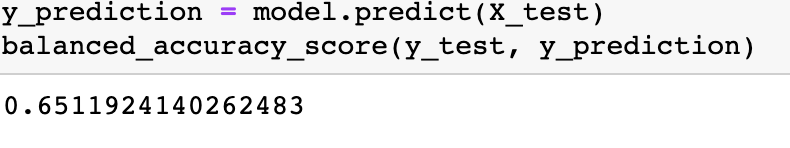
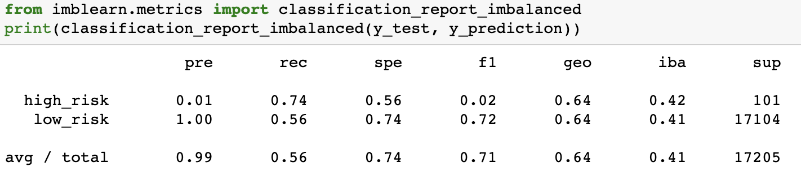

- SMOTE Oversampling - This model has a similar balanced accuracy score, but the F1 score is slightly improved using this model. However, better fitting is available.
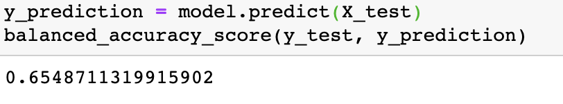
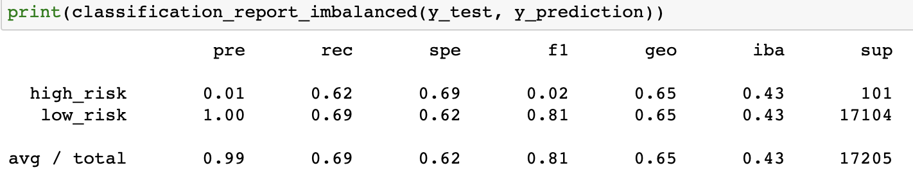

- Undersampling - This model doesn't offer any improvements.
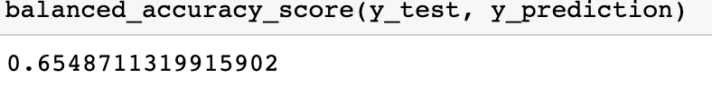
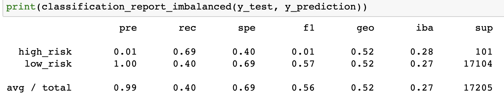

- SMOTEENN (Over and Undersampling) - Here, the balanced accuracy score decreases with a similar f1 as the niave random sampling, thus not an improvement.
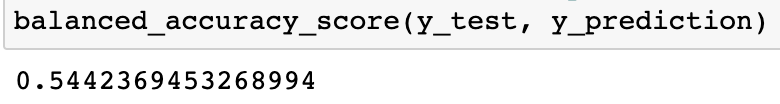
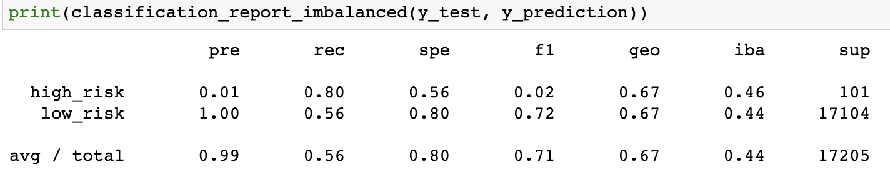

- Random Forest - This model offers a marked increase in the accuracy and F1 score for this model representing this data. That balanced accuracy score can still be improved, but it is showing promise as compared to the oversampling and undersampling models.
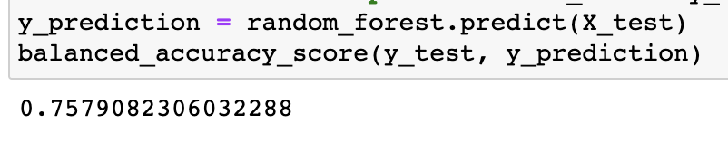
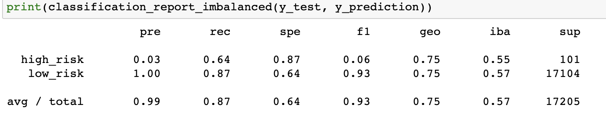

- AdaBoost - This model looks to be the best representation of what the data would produce. The predictions show an accuracy of more than 90% and the F1 score is the highest.
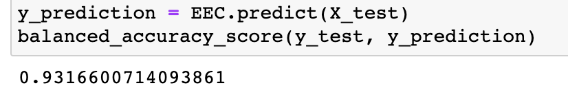
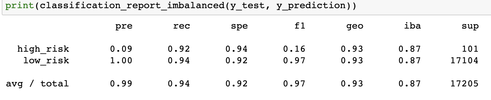

---

#### ***Summary: Summarize the results of the machine learning models, and include a recommendation on the model to use, if any. If you do not recommend any of the models, justify your reasoning.***
###### ***There is a summary of the results (2 pt)***
###### ***There is a recommendation on which model to use, or there is no recommendation with a justification (3 pt)***

 Due to the unbalanced nature of the data set, a straight naïve random sampling model was not an acceptable strategy for this analysis, demonstrated in the accuracy and F1 scores detailed above. It was interesting to go through all of the models to find the best fit. Ultimately the ETA boost model provided that shit..Overall, the Easy Ensemble AdaBoost model is showing the best accuracy and F1 score for this dataset.  I would recommend using it for future credit risk analysis of new applicants.